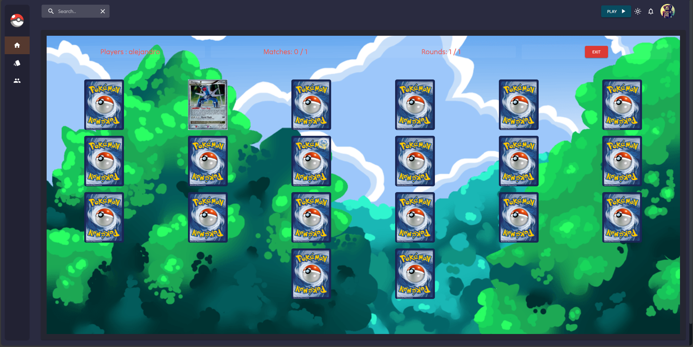
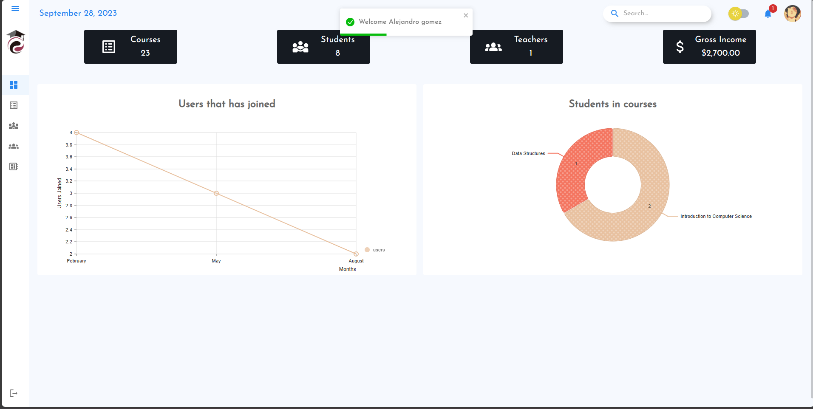
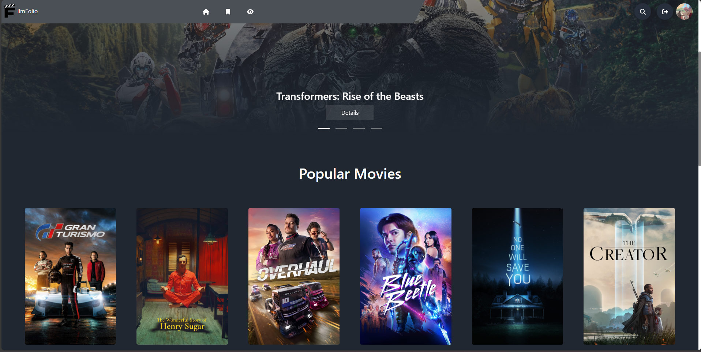

### Hi there, I'm Alejandro Gomez 👋

I'm a passionate web developer and programming enthusiast based in Salt Lake City, Utah, originally from Colombia. Currently, I'm pursuing a Web Development and Programming career at Mountainland Technical College (Mtech). I thrive on crafting software solutions and exploring the limitless possibilities of code.

#### What I Love to Do 💻

- 🚀 Creating web applications using a variety of programming languages, including JavaScript, Python, and utilizing databases like MySQL.
- ⚛️ Building interactive and dynamic user interfaces with front-end frameworks like React and Angular.
- 🖥️ Exploring the world of server-side development with Node.js.
- 📱 Developing cross-platform mobile apps with Flutter.
- 🧩 Solving complex problems and learning something new every day.

#### My Projects 🛠️

I've worked on a diverse range of projects, from web applications to mobile apps. Check out some of my repositories to see my coding journey in action!

Feel free to connect with me and explore my work. Let's collaborate and build amazing things together! 🌟

### My Projects 🛠️

Here are two of my latest projects that I'm proud of:

#### Poke Match Game: ([Check Me!](https://github.com/AlejoC98/React-PokeApp))

_Description: Dive into the captivating world of Pokémon with my Poke Match Game and Pokémon TCG Card Viewer! This project combines the excitement of a memory match game with the comprehensive experience of exploring the Pokémon Trading Card Game universe._

#### College Register App: ([Check Me!](https://github.com/AlejoC98/RegisterApp))

_Description: Welcome to RegisterApp, the ultimate Collage Course Management System designed to streamline the educational experience for both students and teachers. With RegisterApp, you can efficiently manage courses, track students' progress, and facilitate communication within your academic community._

#### Rating Movie App: ([Check Me!]([https://github.com/AlejoC98/film-folio))

_Description: Step into the world of cinematic exploration with FilmFolio, your one-stop destination for movie enthusiasts. FilmFolio is a feature-rich platform that allows you to dive deep into the world of films, rate your favorites, share your thoughts, and build your personal movie collection._

Feel free to explore these projects by clicking on the links above. You can find more of my work in my [GitHub repositories](link-to-your-github).
